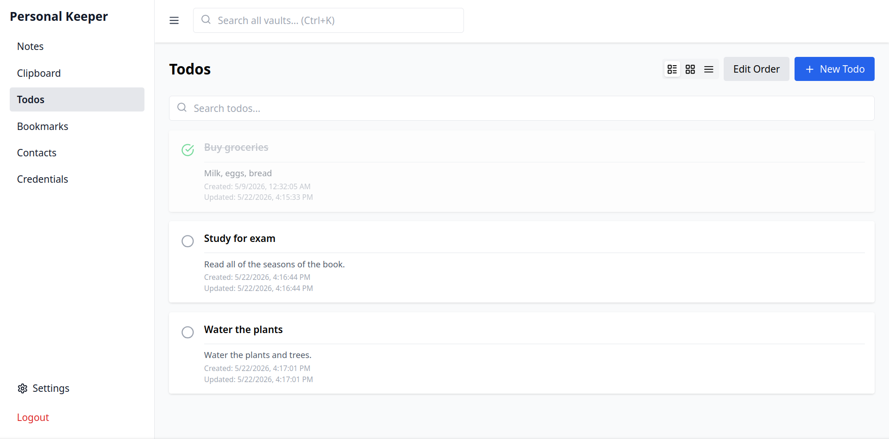
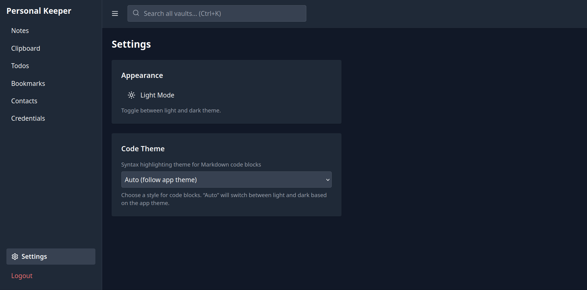
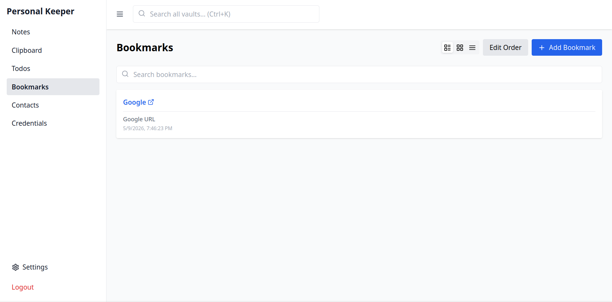

# Personal Keeper

A self-hosted, offline-first personal knowledge base and vault. Securely store notes, bookmarks, clipboard snippets, todos, contacts, and encrypted credentials — all accessible through a single, modern web interface.

[](https://www.rust-lang.org/)
[](https://www.typescriptlang.org/)
[](https://reactjs.org/)
[](LICENSE)

<p align="center">
  
  
  
</p>

---

## Features

- **Notes** — Full‑text Markdown notes with syntax highlighting and live preview.
- **Clipboard** — Quick snippets with copy‑to‑clipboard and auto‑direction (RTL/LTR) support.
- **Todos** — Task list with completion tracking.
- **Bookmarks** — Store URLs with titles, descriptions, favicon and thumbnail (binary) support.
- **Contacts** — Phone, email, address and notes for every contact.
- **Credentials Vault** — Encrypt passwords, notes and TOTP secrets with AES‑256‑GCM.
    - Master password protected; all sensitive fields are encrypted at rest.
    - Lock/unlock the vault on demand.
- **Global Search** — Search across all vaults at once (Ctrl+K / Cmd+K).
- **Dark Mode** — Automatic or manual toggle; remembers your preference.
- **Authentication** — User registration and login with JWT (access + refresh tokens).
- **Responsive** — Works on desktop and mobile with a collapsible sidebar.
- **Self‑contained** — Single binary backend (Rust) with embedded SQLite, serves the frontend in production.

---

## Tech Stack

### Backend (Rust workspace)
- **Framework**: [Actix Web 4](https://actix.rs/)
- **Database**: SQLite via [rusqlite](https://github.com/rusqlite/rusqlite) + [r2d2](https://github.com/sfackler/r2d2) connection pool
- **Migrations**: [refinery](https://docs.rs/refinery/)
- **Authentication**: JWT ([jsonwebtoken](https://docs.rs/jsonwebtoken/))
- **Password Hashing**: Argon2id ([argon2](https://docs.rs/argon2/))
- **Encryption**: AES‑256‑GCM ([aes-gcm](https://docs.rs/aes-gcm/))
- **Serialization**: [serde](https://serde.rs/) + [serde_json](https://docs.rs/serde_json/)

### Frontend (React)
- **UI**: React 18, TypeScript, Tailwind CSS
- **Routing**: React Router v6
- **State**: Zustand (auth store)
- **Markdown**: react-markdown + remark-gfm + rehype-highlight
- **HTTP**: Axios with automatic token refresh
- **Build**: Vite + PWA plugin

---

## Directory Structure

```
personal-keeper/
├── crates/                     # Rust workspace
│   ├── api/                    # Actix-web server (binary)
│   │   ├── src/
│   │   │   ├── main.rs         # App entry point, routes
│   │   │   ├── middleware/     # JWT authentication middleware
│   │   │   └── routes/         # Handlers for each vault
│   ├── domain/                 # Shared models, traits, errors
│   ├── crypto/                 # Hashing, JWT, vault encryption
│   ├── storage-sqlite/         # SQLite pool, migrations, repositories
│   ├── cli/                    # (future) CLI interface
│   └── sync/                   # (future) sync engine
├── frontend/                   # React SPA
│   ├── src/
│   │   ├── components/         # UI components and vault pages
│   │   ├── lib/                # API client, auth store, markdown helpers
│   │   └── context/            # Confirmation dialog provider
│   ├── public/                 # Fonts and static assets
│   └── ...                     # Vite, Tailwind config files
├── Cargo.toml                  # Workspace definition
├── .env.example                # Example environment variables
└── README.md
```

---

## Prerequisites

- **Rust** (stable, 1.70+ recommended) — [install Rust](https://rustup.rs/)
- **Node.js** (18+) and **npm** (9+) — [install Node.js](https://nodejs.org/)

---

## Installation & Setup

### 1. Clone the repository

```bash
git clone https://github.com/your-username/personal-keeper.git
cd personal-keeper
```

### 2. Backend

The backend uses SQLite, so no external database is required.

```bash
# From the project root, copy the environment file and edit it
cp .env.example .env
# Open .env and set a strong, random JWT_SECRET
```

### 3. Frontend

```bash
cd frontend
npm install
```

---

## Running the Application

### Development

During development you can run the backend and frontend separately. The Vite dev server will proxy API requests to the backend automatically.

**Start the backend:**

```bash
cargo run -p api
```
The server will start on http://0.0.0.0:8080.

**Start the frontend dev server:**

```bash
cd frontend
npx vite --host 0.0.0.0
```
Open http://localhost:5173 in your browser. All API calls are forwarded to the backend.

### Production

1. **Build the frontend:**
   ```bash
   cd frontend
   npx tsc && npx vite build
   ```
   This outputs static files to `frontend/dist`.

2. **Run the backend** (it serves the frontend from `./frontend/dist` automatically):
   ```bash
   cargo run --release
   ```
   Visit http://localhost:8080. The SPA fallback handles client‑side routing.

> **Note**: In production, set `JWT_SECRET` to a long, random string (e.g., `openssl rand -hex 32`).

---

## Configuration

All configuration is done via environment variables. For convenience, create a `.env` file in the project root.

| Variable     | Description                             | Default                      |
|--------------|-----------------------------------------|------------------------------|
| `JWT_SECRET` | Secret key for signing JWT tokens       | `dev-secret-not-for-production` |

The SQLite database is stored at `data/personal-keeper.db` (created automatically).

---

## API Endpoints

The API is served under `/api`. Authentication is required for all endpoints except `/health` and auth routes.

### Authentication

| Method | Endpoint           | Description               |
|--------|--------------------|---------------------------|
| POST   | `/api/auth/register` | Register a new user       |
| POST   | `/api/auth/login`    | Obtain tokens             |
| POST   | `/api/auth/refresh`  | Refresh access token      |
| GET    | `/api/auth/me`       | Get current user info     |

### Vaults (all require `Authorization: Bearer <token>`)

**Notes**
- `POST /api/notes` – Create
- `GET /api/notes` – List all
- `PUT /api/notes/:id` – Update
- `DELETE /api/notes/:id` – Delete

**Clipboard**
- `POST /api/clipboard` – Create snippet
- `GET /api/clipboard` – List all (optional `?search=`)
- `DELETE /api/clipboard/:id` – Delete

**Todos**
- `POST /api/todos` – Create
- `GET /api/todos` – List all (optional `?search=`)
- `PUT /api/todos/:id` – Update (e.g., mark completed)
- `DELETE /api/todos/:id` – Delete

**Bookmarks**
- `POST /api/bookmarks` – Create
- `GET /api/bookmarks` – List all (optional `?search=`)
- `PUT /api/bookmarks/:id` – Update
- `DELETE /api/bookmarks/:id` – Delete

**Contacts**
- `POST /api/contacts` – Create
- `GET /api/contacts` – List all (optional `?search=`)
- `PUT /api/contacts/:id` – Update
- `DELETE /api/contacts/:id` – Delete

**Credentials**
- `GET /api/credentials/status` – Check if vault is configured
- `POST /api/credentials/unlock` – Set/verify master password
- `POST /api/credentials/lock` – Lock the vault
- `POST /api/credentials` – Create credential (encrypted)
- `GET /api/credentials` – List credentials (no decrypted secrets)
- `GET /api/credentials/:id` – Get one credential (decrypted, requires unlock)
- `PUT /api/credentials/:id` – Update
- `DELETE /api/credentials/:id` – Delete

---

## Security

- **Passwords**: Hashed with Argon2id (memory‑hard, resistant to GPU attacks).
- **JWT**: Access tokens expire in 15 minutes; refresh tokens in 7 days. Refresh tokens are rotated on each use.
- **Credential Vault**: Master password derives a 256‑bit key via Argon2id. Individual credentials are encrypted with AES‑256‑GCM using random nonces. Encrypted data is stored as base64 JSON in SQLite.
- **Automatic lock**: The server holds the derived key only in memory; a lock endpoint clears it, requiring the master password again.

---

## Contributing

Contributions are welcome! Please open an issue first to discuss what you would like to change.

### Development setup

1. Fork the repository.
2. Create a feature branch.
3. Make sure the backend compiles (`cargo build`) and the frontend passes TypeScript checks (`npm run build` or `npx tsc --noEmit`).
4. Submit a pull request.

---

## License

This project is licensed under the MIT License. See the [LICENSE](LICENSE) file for details.

---

Enjoy your personal knowledge base!